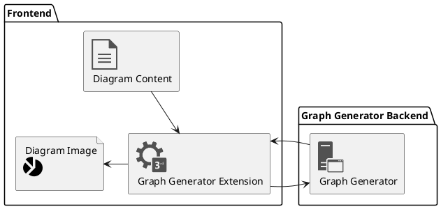

# Graph Generator Server

In my experience adding a diagram into markdown has never been that convenient. Either you have to upload images then reference them (and redo this everytime something changes), or depend on external services through other inconvenient means. This project aims to fix just that.

## Supported Languages
- [X] plantuml
- [X] dot/graphviz
- [X] mermaid
- [X] ditaa
- [X] actdiag
- [X] nwdiag
- [X] blockdiag
- [X] seqdiag
- [X] packetdiag
- [X] rackdiag
- [ ] erd
- [ ] msc
- [ ] shaape
- [ ] syntrax
- [ ] umlet
- [ ] vega
- [ ] vegalite
- [ ] wavedrom

## Running the server

1. Before anything check the following _**list of prerequisites**_. These tools have to be installed and updated to the latest for the installation step to succeed. The server is designed to be quite independant, so a lot of the binaries required by the server, and their dependencies will be downloaded and/or compiled during the initial setup.
    *  A Linux host
    *  Java (`java`)
    *  Wget (`wget`)
    *  Python2.X (`python`)
    *  NodeJs (`node`)
    *  `gcc` and `g++`
    *  `make`
2. Clone this repository.
3. Move to the root directory (of the repository) and run the `setup.sh` file. 
4. If everything goes well, you should be able to start the server with the `start.sh` file.

## Using the Server

Now for the diagrams to show up, the server has to see your diagram contents, and the generated diagram should somehow appear on your screen. So we have developed a couple of ways of making this happen. But if we are missing something [feel free to file an issue](https://github.com/sathukorale/graph-generator/issues/new).

### 1. Through Supported Extensions.
> Before anything, shortcomings : Anyone who views your file have to have these externals tools installed. Otherwise its pretty non-intrusive. Honestly I prefer this method over the others.

> If you have one of our extensions installed you should see the diagram above, rendered.

### 2. By Embedding Diagram Image Urls.
> Before anything, shortcomings : These diagram files should be visible to the `graph-generator` server. And this method works only if you can embed images into your documentations. Thus this won't render standalone diagrams.

